Sionna 3D地圖使用教學
===

在Sionna中使用的地圖需為Mitsuba格式，以下流程為教學如何使用Blender+OpenStreetMap來輸出成Mitsuba格式的檔案。  

- Blender: 3D圖形製作軟體
- OpenStreetMap: 開源的地圖資訊(包含建築物的資訊)
- Mitsuba: 一種渲染工具的格式，適合用於Ray tracing的環境

## 環境建置

1. 安裝[Blender](https://www.blender.org) 
    - 建議安裝 Blender4.2.9，可至[blender-release](https://download.blender.org/release/)下載，最新的可能會有相容性問題
2. 安裝[Blender-OSM](https://github.com/vvoovv/blosm)插件 
    - 進入 [https://prochitecture.gumroad.com/l/blender-osm](https://prochitecture.gumroad.com/l/blender-osm)，並在圖上1.的位置輸入想要donate的金額(可以輸入0)並點擊`I want this!`進入下一步
    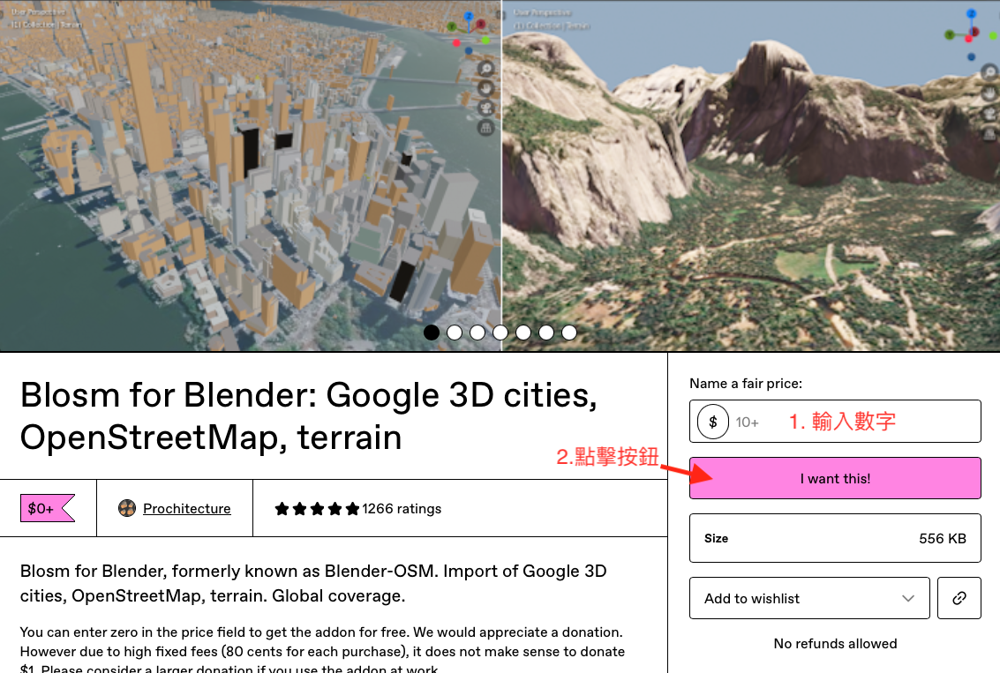
    - 填寫信箱和付款金額(也可以輸入0)
    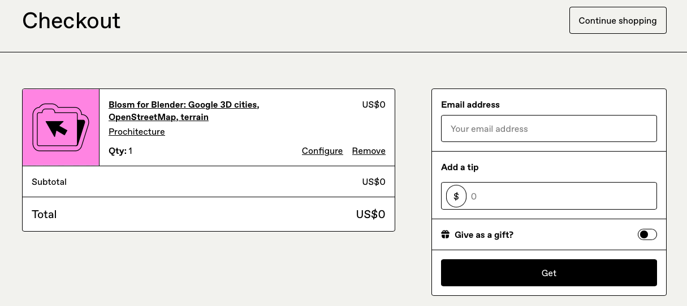
    - 看到以下畫面後就可以下載了插件了，下載後會是一個`blosm.zip`的檔案(MacOS會自動解壓縮，需要再壓縮回去)
    - 打開Blender -> Edit -> Preferences -> Add-ons -> 點選右上像V的圖案，點選`Install from Disk`後選擇`blosm.zip`即可
    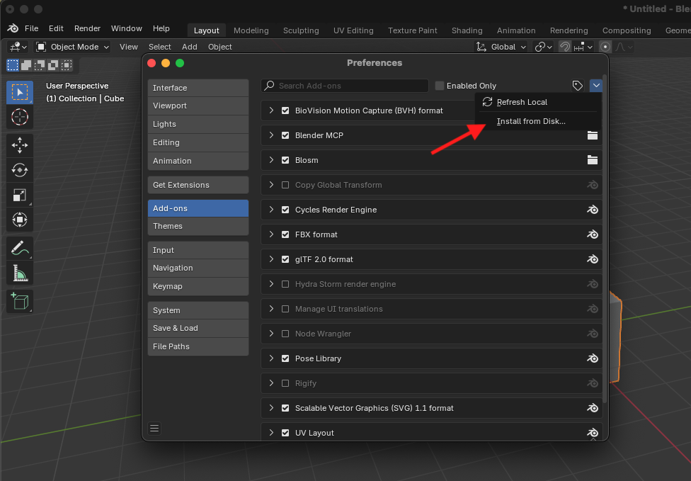
    - 安裝完`Blosm`後，在`Preferences`紅色箭頭的地方輸入未來OSM地圖儲存的路徑
    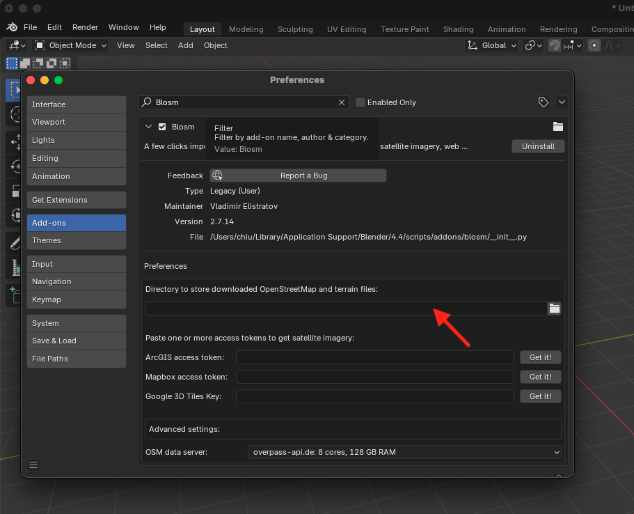
    - 之後就可以在下圖紅色圈圈的位置找到Blosm的插件
    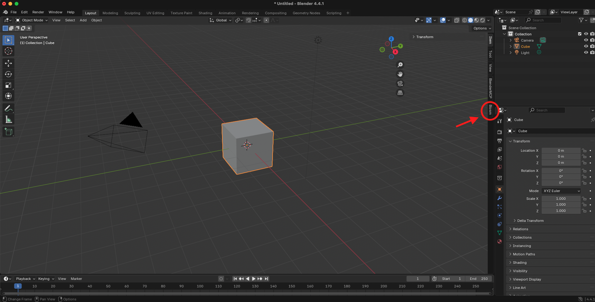
3. 安裝[Blender-Mitsuba](https://github.com/mitsuba-renderer/mitsuba-blender)插件
    - 在[Mitsuba-blender-release](https://github.com/mitsuba-renderer/mitsuba-blender/releases)下載`v0.4.0`的`mitsuba-blender.zip`。(MacOS一樣要注意自動解壓縮的問題)
    - 按照和Blender-OSM相同的步驟安裝
    - 安裝完後可能會缺少部分套件，請依照下圖的位置點選`Install dependencies`
    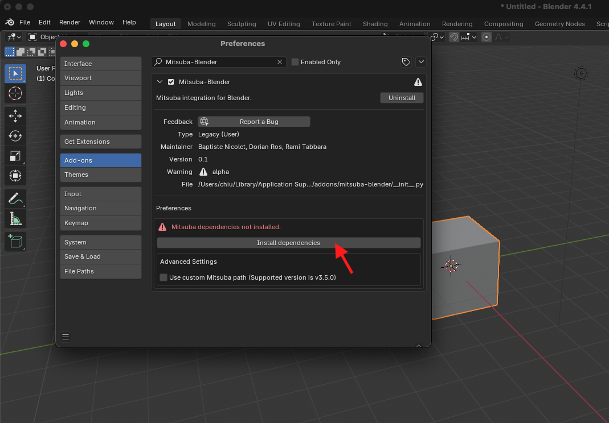
    - 之後到File -> Export就能看到Blender已經支援輸出Mitsuba格式了
    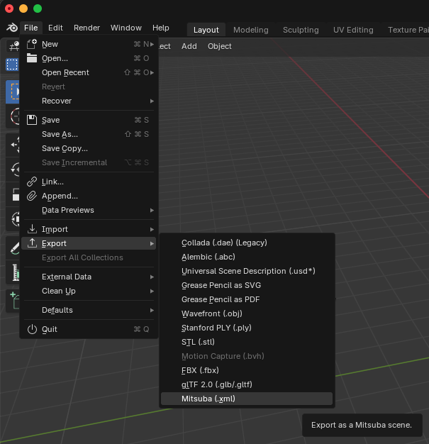

## 使用教學
使用教學將包含如何將地圖資訊匯入Blender並輸出成Mitsuba格式，然後再讓Sionna去讀取
1. 匯入OpenStreetMap地圖
    - 打開Blosm插件，並點選`select`
    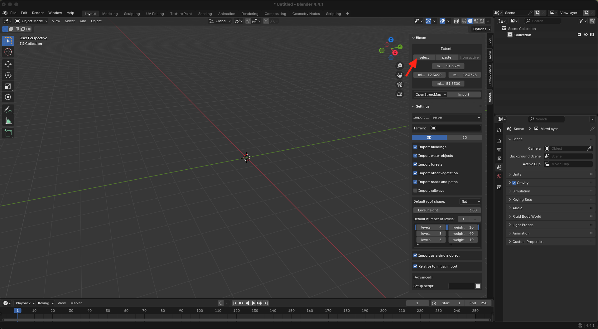
    - 之後會進到地圖頁面，請把地圖畫面放大並移動到自己想要的範圍，然後按下`Show selection rectangle`
    - 確認好範圍後按下`Copy`，之後電腦就會複製指定範圍的GPS座標(左下的`Corrdinates`欄位)
    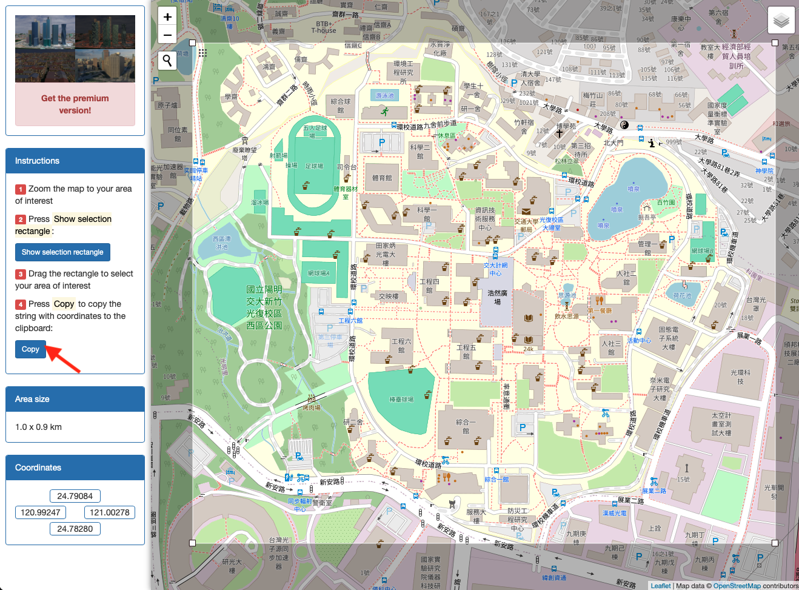
2. 回到`Blender`，按照下圖1~3的順序操作：
    1. 按下`paste`貼上GPS資訊
    2. 確認資料源是`OpenStreetMap`
    3. 按下`import`導入地圖資訊(在導入之前可以在下方`Settings`的地方根據需求來做設定)
    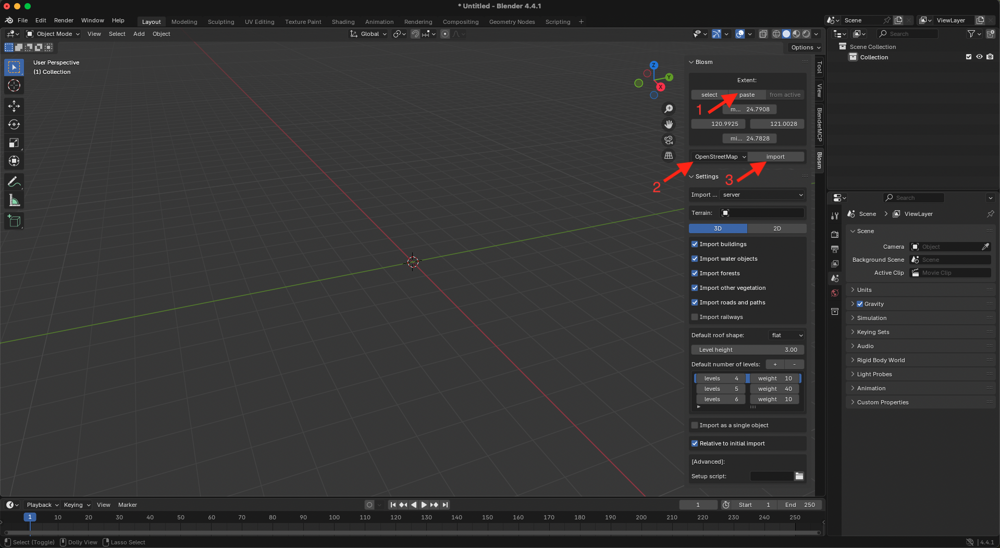
3. 導入地圖後就可以看到像是下圖的樣子
    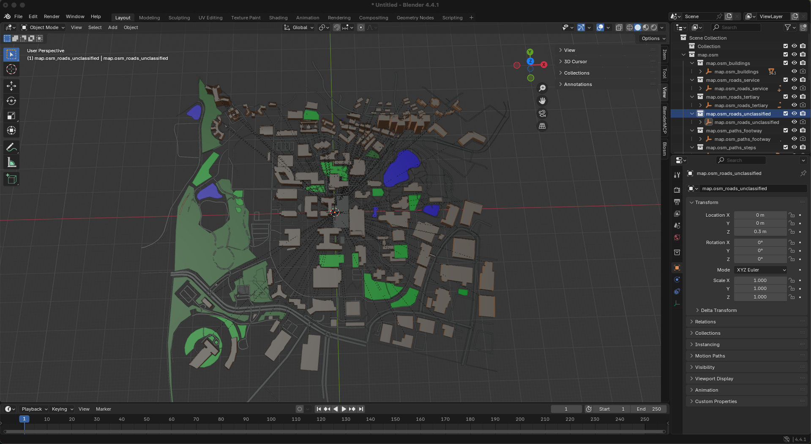
4. 可以在這邊設定一些物件的屬性，包含顏色和物件名稱之類的，之後在Sionna裡面可以用到，不設定用預設的也行(note: 如果希望渲染出來的建築物是有顏色的話，要記得放一個太陽的物件到Blender裡，不然都會是黑色的)
5. 設定完地圖後點選 File -> Export -> Mitsuba -> Mitsuba Export，之後就可以匯出Mitsuba格式的檔案了
(note: setting的部分也可以根據需求調整，尤其是xyz座標的方向)
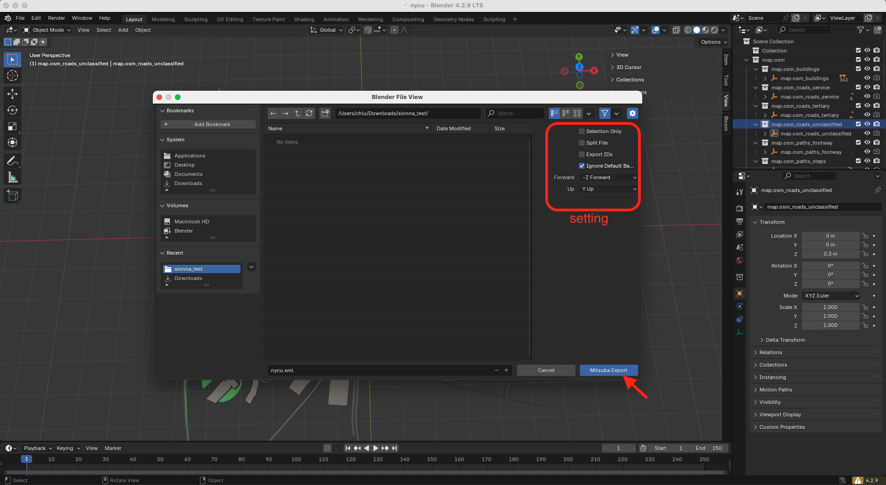
6. 看見資料夾裡面有<檔名>.xml和meshes就代表輸出完成了(meshes裡面會有各物件的ply檔)，之後使用的時候需要讓xml檔和meshes資料夾在同一個路徑中，路徑如下：

    folder  
    ├── <檔名>.xml  
    └── meshes  
    　   ├── object1.ply  
    　   ├── object2.ply  
    　   ├── object3.ply  
    　   └── ⋮  
7. 在Sionna裡面的使用教學請參照 [Demo_ray_tracing.ipynb](../sample_code/Demo_ray_tracing.ipynb)
